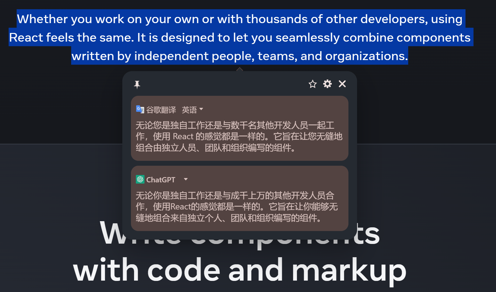

## 一些网站自定义css


### [v2ex](https://www.v2ex.com/) 自定义css主题，material design 3 风格

#### 使用方式

v2ex设置中自定义css填入
```
@import url("https://v2ex-style.pages.dev/style.css");
```

或者自己托管css, (v2ex自定义css的输入框限制了9k大小)


### [划词翻译](https://hcfy.app/)浏览器插件 自定义css主题，material design 3 风格

##### 使用方式

插件设置 -> 通用设置 -> 外观 -> 自定义面板样式

填入css代码




